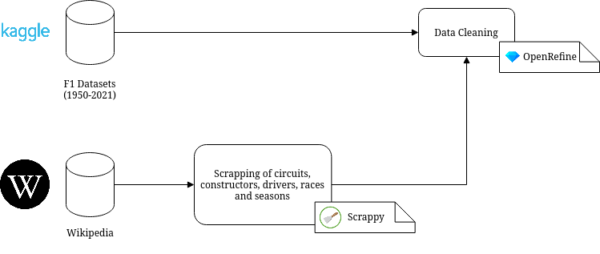

# PRI

# Bibliography

- https://www.kaggle.com/rohanrao/formula-1-world-championship-1950-2020
- https://www.kaggle.com/codingminds/formula-1-race-fan-ratings

# Identification and briefly description of the datasets selected

- **circuits.csv**: circuitId, circuitRef, name, location, country, latitude, longitude, altitude and URL to Wikipedia information
- **drivers.csv**: driverId, driverRef, number, code (3 letters), forename, surname, date of birth, nationality and URL to Wikipedia information
- **constructors.csv**: constructorId, constructorRef, name, nationality, URL to Wokipedia information
- **seasons.csv**: year and URL to Wikipedia information about that season
- **qualifying.csv**: id, raceId, driverId, constructorId, number, position, q1,q2,q3
- **pit_stops.csv**: raceId, driverId, stop, lap, time, duration, milliseconds
- **races.csv**: raceId, year, round, circuitId, name, date, time, URL to Wikipedia information
- **status.csv**: statusId, status ("Finished", "Disqualified", etc)
- **results.csv**: resultId, raceId, driverId, constructorId, number, grid, position, positionText, positionOrder, points, laps, time, milliseconds, fastestLap, rank, fastestLapTime, fastestLapSpeed, statusId
- **lap_times.csv**: raceId, driverId, lap, position, time, milliseconds
- **driver_standings.csv**: driverStandingsId, raceId, driverId, points, position, positionText, wins
- **constructor_standings.csv**: constructorStandingsId, raceId, constructorId, points, position, positionText, wins
- **constructor_results.csv**: constructorResultsId, raceId, constructorId, points, status

# First draft of the data processing pipeline

## Data Collection
### Scrapy
- circuits, constructors, drivers, races, seasons

## Data Preparation
### Data Cleaning
- Remove position column from constructor_standings.csv, results.csv, driver_standings.csv. We already have positionText column that gives more information (position, R(etired), D(isqualified))

