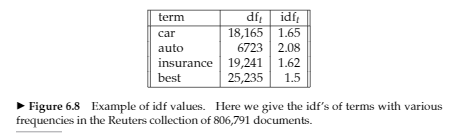
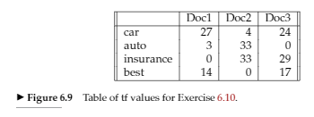
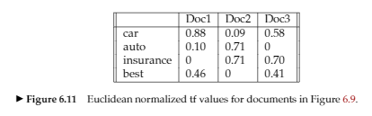

## Exercises

## Vector model

### 6.8. Why is the idf of a term always finite?

- idf(term) = log(Total no. documents / df(term))
- df(term) >= 1

So:
- idf(term) <= log(N)
- idf always finite.

### 6.9. What is the idf of a term that occurs in every document? Compare this with the use of stop word lists.

- idf(term) = log(Total no. documents / df(term))
- Total no. documents / df(term) = 1
- idf(term) = log(1) = 0

Using that term on the stop lists has the same effect: the word is ignored.

### 6.10. Consider the table of term frequencies for 3 documents denoted Doc1, Doc2, Doc3 in Figure 6.9. Compute the tf-idf weights for the terms car, auto, insurance, best, for each document, using the idf values from Figure 6.8.

tf-idf(t, d) = tf(t, d) * idf(t). 
td-idf weights:

|           | Doc1  | Doc2  | Doc3  |
| -         | -     | -     | -     |
| car       | 44.55 | 6.6   | 39.6  |
| auto      | 6.24  | 68.64 | 0     |
| insurance | 0     | 53.46 | 46.98 |
| best      | 21    | 0     | 25.5  |

### 6.11. Can the tf-idf weight of a term in a document exceed 1?

Yes (just look at Exercise 6.10).

### 6.15. Recall the tf-idf weights computed in Exercise 6.10. Compute the Euclidean normalized document vectors for each of the documents, where each vector has four components, one for each of the four terms.

- Euclidean length of d: sqrt(sum(every term in a document^2)).
- Euclidean normalized tf values: tf values/Euclidean length for the document (6.11).

Doing the same but with the tf-idf weights:

Euclidean length for each document:
- Doc1: sqrt(44.55^2 + 6.24^2 + 21^2) = 49.65
- Doc2: sqrt(6.6^2 + 68.64^2 + 53.46^2) = 87.25
- Doc3: sqrt(39.6^2 + 46.98^2 + 25.5^2) = 66.52

Euclidean normalized document vectors: td-idf weights / Euclidean length:
- Doc1: (0.897, 0.125, 0, 0.423)
- Doc2: (0.076, 0.786, 0.613, 0)
- Doc3: (0.595, 0, 0.706, 0.383)

### 6.16. Verify that the sum of the squares of the components of each of the document vectors in Exercise 6.15 is 1 (to within rounding error). Why is this the case?

- Doc1: 0.897^2 + 0.125^2 + 0.423^2 = 0.999
- Doc2: 0.076^2 + 0.786^2 + 0.613^2 = 0.999
- Doc3: 0.595^2 + 0.706^2 + 0.383^2 = 0.999

Normalized vectors = unit vectors.

### 6.17. With term weights as computed in Exercise 6.15, rank the three documents by computed score for the query "car insurance", for each of the following cases of term weighting in the query:
i) The weight of a term is 1 if present in the query, 0 otherwise.
ii) Euclidean normalized idf.

Query: car insurance

- i) Term weights: 
| Term      | Doc1  | Doc2  | Doc3  |
| -         | -     | -     | -     |
| car       | 0.897 | 0.076 | 0.595 |
| auto      | 0.125 | 0.786 | 0     |
| insurance | 0     | 0.613 | 0.706 |
| best      | 0.423 | 0     | 0.383 |

| Term      | tf        | Weight    | Doc1      | Doc2      | Doc3      |
| -         | -         | -         | -         | -         | -         |
| car       | 1         | 1         | 0.897     | 0.076     | 0.595     |
| auto      | 0         | 0         | 0         | 0         | 0         |
| insurance | 1         | 1         | 0         | 0.613     | 0.706     |
| best      | 0         | 0         | 0         | 0         | 0         |

- Score(q, Doc1) = 0.897
- Score(q, Doc2) = 0.689
- Score(q, Doc3) = 1.301 TODO: nas soluções o valor em Doc3 do termo insurance está 0, está errado right?
- Ranking: d3, d1, d2.

- ii) Euclidean normalized idf TODO: não sei como acabar este exercício

| Term      | idf       | Weight    | Doc1      | Doc2      | Doc3      |
| -         | -         | -         | -         | -         | -         |
| car       | 1.65      | 1         |
| auto      | 2.08      | 0         |
| insurance | 1.62      | 1         |
| best      | 1.5       | 0         |